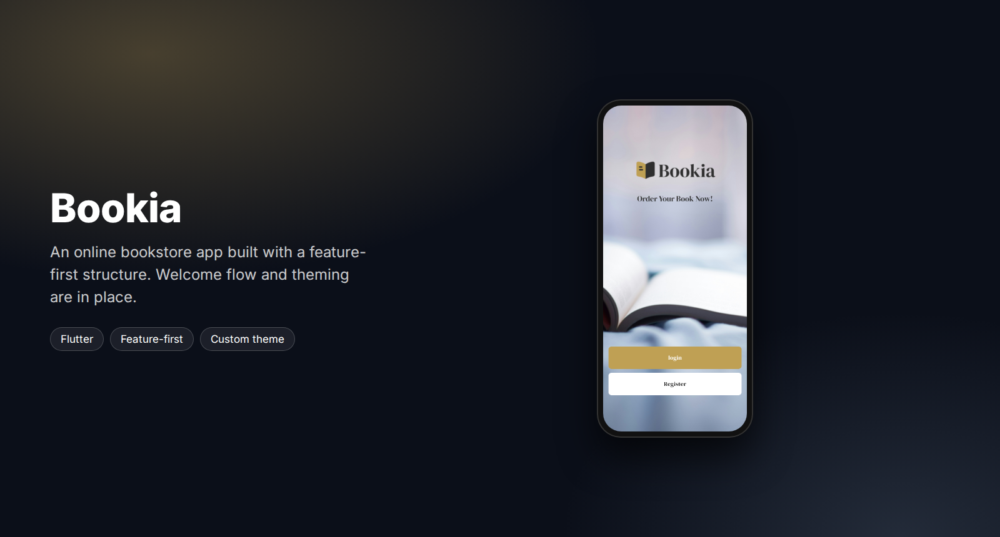

<div align="center">



<br/>

[](https://flutter.dev)
[](https://dart.dev)
[](#progress)

**Bookia, an online bookstore app.**
Browse books, save favorites, add to cart and order. Built on a feature-first structure
with a dedicated theme and reusable components.

</div>

---

## Screenshot

<p align="center">
  <br/>
  <sub><b>Welcome</b> · full-bleed artwork, logo and entry to login or register</sub>
</p>

## Progress

| Part | Status |
|:--|:--|
| Project structure (feature-first: `data` / `presentation` per feature) | ✅ |
| Light theme with DM Serif Display, color palette, shared button widget | ✅ |
| Native splash screen and launcher branding | ✅ |
| Welcome screen | ✅ |
| Login screen layout | 🔄 in progress |
| Register, auth state (Cubit) and repository | 🔄 in progress |
| Home catalog, book details | ⏳ planned |
| Cart, bookmarks, profile, bottom navigation | ⏳ planned |
| Dark theme | 🔄 defined, not wired yet |

## Structure

```
lib/
├── core/
│   ├── coloers/            color palette
│   ├── theming/            light and dark themes
│   └── Wedgiet/            shared widgets (button, app bar)
├── features/
│   ├── welcome/            welcome screen
│   ├── auth/               login, register, cubit, repository
│   ├── home_screen/
│   ├── car_screen/         cart
│   ├── mark_book_screen/   bookmarks
│   ├── person_screen/      profile
│   └── bottom_nav_bar/
├── bokia_app.dart
└── main.dart
```

## Tech stack

| Area | Choice |
|:--|:--|
| Framework | Flutter, Dart |
| Structure | feature-first, one folder per feature with `data` and `presentation` |
| Theming | custom `ThemeData` and text theme, DM Serif Display |
| Splash | `flutter_native_splash` |
| Assets | `flutter_gen` |

## Getting started

```bash
flutter pub get
flutter run
```

## Author

**Osama Yosef** · Flutter developer, Cairo

[](https://github.com/osama-Yosef)
[](https://www.linkedin.com/in/osama-yosef-819268319)
[](https://upwork.com/freelancers/~014ebd205ef38ca04c)
[](mailto:osamayosef038@gmail.com)
